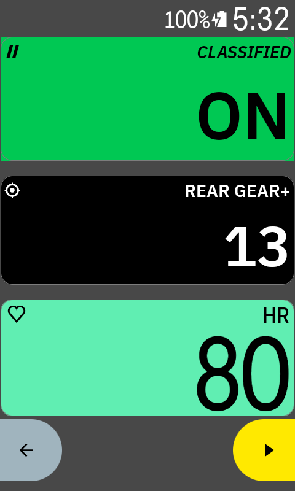
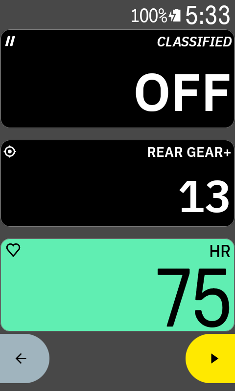
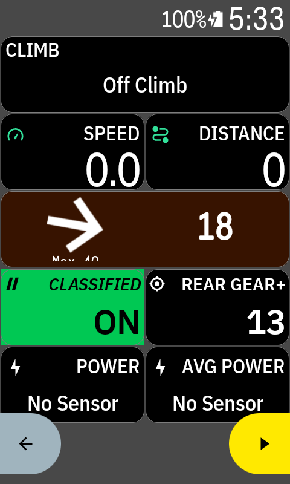

# karoo-classified

Karoo data fields that keep working when two shifting sensors are paired at once.

A Karoo shows gear data from **one** shifting sensor at a time. Pair a Classified
Powershift hub alongside an electronic drivetrain and one of them wins; the
other's fields freeze. This extension reads both, so neither disappears.

| Field | Shows |
|---|---|
| **Classified** | `ON` when the hub's reduced ratio is engaged, `OFF` in direct 1:1 |
| **Rear Gear+** | Rear gear straight from the derailleur, unaffected by the arbitration |

The Classified tile fills green when the reduction is engaged, so it reads at a
glance without focusing on it.

| Reduced ratio engaged | Direct 1:1 |
|---|---|
|  |  |

Both sensors are paired at once in these shots, and both fields are live. Karoo's
own gear fields would show only one of them; `Rear Gear+` keeps tracking the
derailleur regardless.

Both fields also sit correctly among the built-in tiles at half width:



Each tile draws its own header rather than using Karoo's. That is what lets the
Classified tile colour its whole background, and it leaves more room for the value:
Karoo's header takes 69px of a 126px tile, leaving 57px, where this label row costs
less.

> **Use at your own risk.** This is a personal project, not a product. It binds an
> interface Hammerhead neither documents nor supports, and it has only ever been
> tested with a **Classified Powershift hub + SRAM RED XPLR AXS** on a Karoo 3.
> No other combination has been tried. There is no warranty of any kind - see
> [LICENSE](LICENSE).
>
> **Installing this yourself?** Read [Limitations](#limitations) first. It is pinned
> to one Karoo firmware version, and it will need maintenance. It works, but it is
> not a polished app.

---

## Why the native fields break

Classified uses the **standard ANT+ Shifting profile** (device type 34) and reports
its two ratios as a virtual front chainring. Your derailleur uses the same profile.
Karoo, like Garmin, keeps a single active shifting source, so two profile-34 devices
contend for one slot and the loser's data stops being published. (Wahoo is the
outlier that handles both.)

This is a platform policy, not a bug, and an extension cannot change it.

## How this works around it

Karoo's *radio* has no such limit. Its internal sensor service receives every paired
sensor simultaneously - visible in its own logs, and confirmed by AXS Bonus Buttons
continuing to work while its gear fields are frozen. Only the **publishing** layer
picks one winner.

So this extension reads the raw ANT stream from that internal service instead of the
public API:

```
Karoo Sensors app --> shifting role --> one winner --> native gear fields
                                                       (loser frozen)

internal SensorService --> raw ANT stream --> this extension --> both fields
                           (every sensor, tagged by channel ID)
```

Every ANT extended message carries its channel ID, so each packet identifies its own
sender. Devices are told apart by **capability, not identity**: a derailleur reports
a cassette position, a hub reports none (`0x1F`). No device numbers or brands are
hardcoded anywhere.

## Protocol, verified on hardware

ANT+ Shifting page `0x01`, captured from a Classified hub and a 13-speed AXS with the
physical state confirmed at the moment of capture:

```
01 24 FF 3F 40 00 00 00   hub, 1:1 direct
01 25 FF 1F 40 00 00 00   hub, 0.686 reduced
01 40 F5 05 2D 6C 00 00   derailleur, rear gear 6
 |  |  |  |
 |  |  |  +-- byte 3: bits 0-4 rear gear (0-based; 0x1F = none), bit 5 front gear
 |  |  +----- byte 2: constant
 |  +-------- byte 1: shift event counter
 +----------- byte 0: page number
```

- `rearGear = (byte3 & 0x1F) + 1`, verified by sweeping all 13 cogs against Karoo's
  own decoder.
- `frontGear = (byte3 >> 5) + 1`. For the hub, 2 is direct and 1 is reduced - the
  polarity is counter-intuitive, so it was confirmed in both directions rather than
  inferred.

## What was ruled out first

Each of these was tested on a Karoo 3, not assumed:

| Approach | Result |
|---|---|
| Extension opens its own ANT+ channel | **Blocked** - ANT+ network key rejected; RF frequency 57 refused while 50/66/77 are allowed |
| ANT+ Plugins Service shifting profile | **Does not exist** - the SDK ships no gear profile |
| Ratio in the hub's BLE advertisement | **Not there** - 151 adverts across many toggles, zero change |
| BLE GATT connection to the hub | **Refused** - status 62; advertises non-discoverable, wanting a bonded peer |
| Public karoo-ext `streamDataFlow` | **One source only** - handover is sticky; shifting the loser does not win it back |

## Stability, and what to know before relying on it

This binds an **undocumented internal interface**. The transaction numbers were read
out of the service's decompiled dispatch switch rather than guessed, but a Karoo
firmware update can renumber them.

The extension pins the `hxsensorservice` version it was mapped against. On a
mismatch it **sends nothing and calls no transaction** - the fields show `--`. It
fails safe rather than acting on a transaction whose meaning may have changed.

Re-deriving the mapping after a firmware update is scripted and documented:

```bash
./tools/remap-sensorservice.sh
```

See **[REMAPPING.md](REMAPPING.md)** for the runbook, including the known-good
transaction table to compare against.

## The only configuration this has been tested on

Exactly one bike, one head unit, one pair of sensors:

| | |
|---|---|
| Head unit | Karoo 3 (`k24`), Android 12 / API 32 |
| Karoo sensor service | `4.215.1-b362ac0378`, ANT Radio Service 4.15.20 |
| Drivetrain | SRAM RED XPLR AXS, 1x13 |
| Rear derailleur | RED RD XPLR MAX 46T (model 1081), firmware 2.55.12 |
| Shifters | RED CONTROLLER L / R (models 1084 / 1083), firmware 2.55.1 |
| Cassette | 13-speed, 10-36T (`10,11,12,13,14,15,17,18,20,22,25,28,32,36`) |
| Chainring | 1x 50T |
| Hub | Classified Powershift, thru-axle firmware 0.402, shifter 25.5 |

No other groupset, hub, cassette, head unit or firmware combination has been
tested at all - not even briefly. Where this README says something "should" work
elsewhere, that is reasoning from the ANT+ standard, not experience.

## Assumptions

Everything below was derived from captures on one bike. Each is marked with how
strongly it is held, because they are not equally safe.

| # | Assumption | Evidence |
|---|---|---|
| 1 | Page `0x01` byte 3 bit 5 is the hub's ratio; set = direct, clear = reduced | **Verified both directions** against the physical hub |
| 2 | `rearGear = (byte3 & 0x1F) + 1` | **Verified across all 13 cogs** against Karoo's own decoder |
| 3 | A device reporting rear gear `0x1F` is a hub, not a derailleur | Verified on one hub and one derailleur. Principled - a hub has no cassette - but it is a heuristic |
| 4 | `frontGear = (byte3 >> 5) + 1` | Verified for a 1x derailleur and a 2-position hub only. **Never tested against a real front derailleur** |
| 5 | `AntMessage` is `int messageId`, length-prefixed `byte[]`, `long timestamp` | Inferred from observed bytes; consistent across thousands of messages but not from documentation |
| 6 | The channel ID sits at offset 10-13 of the extended ANT payload | Standard ANT extended-message format, confirmed by decoding known device numbers |
| 7 | TX 12 / TX 13 register and unregister the raw ANT listener | Read from the decompiled dispatch switch, confirmed working |
| 8 | Karoo calls `startView` for these fields | Observed. The code no longer *depends* on it - both fields also implement `startStream` |

Assumptions 1-2 are the ones the displayed values depend on, and both were checked
against ground truth. Assumption 4 is the weakest thing anyone extending this
should re-verify first.

## Limitations

Read this section before installing. Most of these will affect you.

**Pinned to one Karoo firmware.** `MAPPED_VERSION` is `4.215.1-b362ac0378`. On any
other version the fields show `--` and nothing is called. Re-run
`tools/remap-sensorservice.sh` - see [REMAPPING.md](REMAPPING.md).

**The native gear fields stay broken.** This does not fix them; it adds fields that
keep working. The hub must still be paired in the Sensors app for Karoo to open an
ANT channel to it, so Karoo's own Front/Rear Gear continue to show whichever sensor
won the arbitration.

**Ride screen only.** Karoo does not publish sensor data to extensions when idle,
so both fields sit at `--` outside a ride.

**One derailleur and one hub.** Devices are matched by capability, not identity. A
bike with two cassette-reporting devices, or two hubs, would have them compete for
the same field with no defined winner.

**A flat sensor battery looks like a bug.** A derailleur low on charge sleeps
aggressively and drops off the air; the field correctly shows `--`, which reads as
the extension failing. Karoo raises its own low-battery notification - trust that
before suspecting this.

**Tiles approximate the native styling.** Label size, icon and text sizing were
matched by eye against the built-in fields, not derived from Karoo's own values,
so they are close but not pixel-identical.

**Untested on anything else.** See [the tested
configuration](#the-only-configuration-this-has-been-tested-on) for exactly what
was used. Karoo 2 has different internals and may not work at all. Other
groupsets, other hubs and 2x drivetrains are entirely unexercised, and no claim is
made about any of them. Nothing in the code is brand-specific - it keys off ANT+
device type 34 and whether a device reports a cassette position - but that is a
reason it *might* work elsewhere, not evidence that it does.

**It binds an undocumented interface.** Hammerhead owes no compatibility here and
can change it in any release. The version pin makes that fail safe rather than
silently wrong, but it will need occasional maintenance.

### What installing actually involves

There is no prebuilt release, and an APK built here will almost certainly refuse
to run on your Karoo because of the version pin. Realistically you need to:

1. Check your Karoo's service version:
   `adb shell dumpsys package io.hammerhead.sensorservice | grep versionName`
2. If it differs from `4.215.1-b362ac0378`, run `tools/remap-sensorservice.sh`,
   compare against the table in [REMAPPING.md](REMAPPING.md), and update the
   constants in `ShiftingStream.kt`.
3. Build and sideload it yourself - JDK 17/21 and the Android SDK, see
   [SETUP.md](SETUP.md).
4. Pair both sensors in Karoo's Sensors app and add the fields to a ride profile.

If a Karoo update later changes the interface, the fields go to `--` and you repeat
step 2. That is the ongoing cost of this approach, and it is the honest reason this
is not distributed as a finished app.

## Layout

```
app/                    the extension
  decode/               ANT+ shifting page decoding, with captured payloads as tests
  transport/            shared raw-ANT stream from Karoo's internal service
  extension/            the two data fields
probe/                  diagnostic app used to derive all of the above
tools/                  remap-sensorservice.sh
```

`probe/` is a throwaway investigation harness, kept because it is how the protocol
work was done and how it would be redone: an ANT environment report, a BLE scanner
and GATT explorer, a karoo-ext stream inspector, and a raw ANT decoder.

## Build

See **[SETUP.md](SETUP.md)**. Briefly: JDK 17/21, Android SDK, and either a GitHub
token for karoo-ext or a local publish of it.

```bash
./gradlew :app:assembleDebug :app:test
adb install -r app/build/outputs/apk/debug/app-debug.apk
```

Both fields only stream while a ride screen is open - Karoo does not publish sensor
data to extensions when idle.

## Use at your own risk

This software is provided as-is, with no warranty and no guarantee of fitness for
any purpose. Anyone installing it does so at their own risk.

Specifically, be aware that:

- It binds an **undocumented internal Karoo interface**. Hammerhead owes no
  compatibility here and may change or remove it in any firmware release.
- A future Karoo update could change what those transactions mean. The version pin
  is designed to prevent that - the extension calls nothing on a mismatch - but it
  is a safeguard written by one person, not a guarantee.
- Displayed gear and ratio values come from a **reverse-engineered decoder** built
  from captures on a single bike. Do not rely on them being correct on other
  hardware without re-verifying against a known state.
- It is **not affiliated with, endorsed by, or supported by** Hammerhead, SRAM, or
  Classified Cycling. Do not ask them to support problems caused by it. Uninstall
  it before reporting any issue to them.
- Anything it might affect - your ride recording, sensor pairings, device
  behaviour - is your responsibility. The safest response to odd behaviour is to
  uninstall the extension and confirm the problem persists without it.

If that trade is not one you want to make, this is the wrong project to install,
and that is a perfectly reasonable conclusion.

## Notes

- The Classified word mark and logo belong to Classified Cycling; the icon here is a
  hand-drawn approximation for personal use.
- karoo-ext is Apache 2.0, (c) SRAM LLC.
- No part of Garmin's ANT SDK is redistributed here. The ANT+ route was investigated
  and found to be blocked; see the table above.
